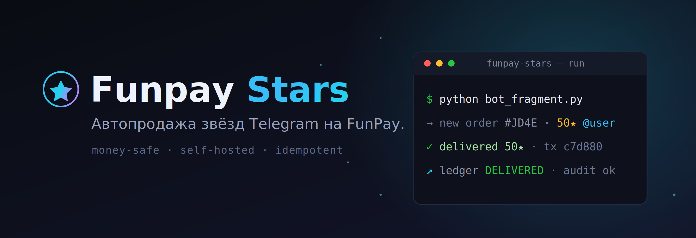
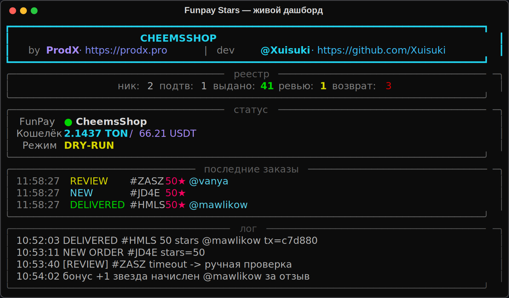
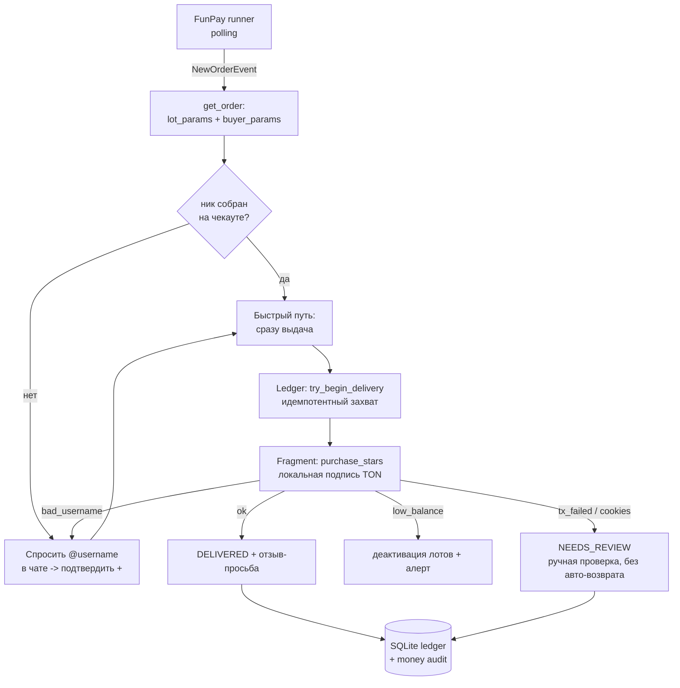

<div align="center">



# Funpay Telegram Stars

**Автоматическая продажа Telegram Stars на FunPay с выдачей через Fragment.**
Money-safe, self-hosted, с живым терминальным дашбордом.

[](https://www.python.org/)
[](LICENSE)
[](https://fragment.com)
[](tests/)
[](https://prodx.pro)

[Возможности](#возможности) · [Как это работает](#как-это-работает) · [Установка](#установка) · [Конфигурация](#конфигурация) · [Безопасность](#денежная-безопасность) · [English](#english)

</div>

---

## Что это

Бот ловит новые заказы на [FunPay](https://funpay.com) в вашей подкатегории Telegram Stars,
берёт количество звёзд и @username **прямо из параметров заказа**, и автоматически дарит
звёзды получателю через [Fragment](https://fragment.com) — подписывая TON-транзакцию
локально (seed-фраза кошелька **не уходит** третьей стороне).

Отличается от типовых ботов тем, что построен как **платёжная система**: идемпотентная
выдача, персистентный реестр заказов, безопасное поведение на неоднозначных ошибках —
никаких «звёзды ушли и деньги вернули».

<div align="center">

<br><i>Живой терминальный дашборд: реестр заказов, баланс, последние выдачи, лог.</i>
</div>

## Возможности

- **Параметры заказа, а не парсинг текста.** Количество звёзд из `lot_params`, @username из
  `buyer_params` — если тег собран на чекауте FunPay, выдача идёт **сразу**, без вопросов в чате.
- **Self-hosted Fragment.** Вендорная PyFragment: seed-фраза кошелька остаётся локально.
- **Денежная безопасность.** SQLite-реестр заказов, идемпотентная выдача (звёзды уходят один
  раз), реконсиляция после рестарта; на неоднозначной ошибке — ручная проверка, не авто-возврат.
- **Умные реакции на ошибки Fragment:** `bad_username` → переспрос, `low_balance` → деактивация
  лотов + опц. возврат, `cookies`/`kyc` → стоп + алерт оператору.
- **Telegram-алерты и команды** `/stats` `/balance` `/review` `/pause` `/resume`.
- **Статистика** (оборот/себестоимость/профит), **бонус +1 звезда за отзыв**, пейсер
  человеческих задержек (по чату — без «петли смерти» под флудом).
- **Анимированный терминал** (Rich): брендовый баннер оператора + живой дашборд.

## Как это работает

FunPay не шлёт вебхуки — бот поллит `funpay.com/runner/` под кукой `golden_key`, получает
события и действует. Выдача идёт через локальную подпись TON-транзакции.



**Стейт-машина заказа:** `AWAITING_NICK` → `AWAITING_CONFIRMATION` → `DELIVERING` →
`DELIVERED` / `FAILED` / `NEEDS_REVIEW` / `REFUNDED`. Переход в `DELIVERING` атомарный —
это и есть гарантия, что звёзды уходят ровно один раз.

## Установка

```bash
git clone https://github.com/Xuisuki/funpay-stars-bot.git
cd funpay-stars-bot
pip install -r requirements.txt
python first_start.py        # мастер настройки (создаёт .env)
python bot_fragment.py       # запуск
```

Для боевого режима нужны:

- **FunPay:** `golden_key` из cookie (запросы — с IP, к которому привязан ключ).
- **Fragment (self-hosted):** отдельный TON-кошелёк-расходник (seed), API-ключ
  [tonconsole.com](https://tonconsole.com), куки сессии fragment.com (`stel_*`).
- **Telegram-бот** от [@BotFather](https://t.me/BotFather) для алертов + ваш TG id.

Пока не заполнили Fragment — держите `DRY_RUN=true`: бот работает по FunPay-части без
реальной траты звёзд.

> Скачать можно через `git clone` или архивом со страницы
> [**Releases**](https://github.com/Xuisuki/funpay-stars-bot/releases).

## Запуск 24/7 (демоном)

Бот на чистом Python и работает одинаково на **Linux, macOS и Windows**. Для боевого
режима держите его запущенным постоянно — готовые примеры в [`deploy/`](deploy/):

**Linux (systemd)**
```bash
sudo cp deploy/funpay-stars.service /etc/systemd/system/   # поправьте пути в файле
sudo systemctl enable --now funpay-stars
journalctl -u funpay-stars -f
```

**macOS (launchd)**
```bash
cp deploy/com.funpaystars.bot.plist ~/Library/LaunchAgents/   # поправьте WorkingDirectory
launchctl load ~/Library/LaunchAgents/com.funpaystars.bot.plist
```

**Windows (Планировщик задач)**
```powershell
# PowerShell от администратора, из папки проекта (поправьте путь к python внутри):
.\deploy\windows_task.ps1
Start-ScheduledTask -TaskName FunpayStarsBot
```

Держите **один экземпляр** на аккаунт FunPay. Реестр `orders.db` переживает рестарты:
незавершённые заказы после перезапуска уходят на ручную проверку.

## Конфигурация

Все переменные — в `.env` (см. [`.env.example`](.env.example)). Ключевые:

| Переменная | Назначение | По умолчанию |
|---|---|---|
| `BRAND_NAME` | бренд в баннере (пусто → имя FunPay-аккаунта) | — |
| `FUNPAY_AUTH_TOKEN` | golden_key FunPay | — |
| `STARS_SUBCATEGORY_ID` | подкатегория с заказами Stars | `2418` |
| `FRAGMENT_SEED` | seed TON-кошелька (локально) | — |
| `TON_API_KEY` | ключ tonconsole.com | — |
| `FRAGMENT_COOKIES` | куки fragment.com (`stel_*`) | — |
| `FRAGMENT_PAYMENT_METHOD` | `ton` (дешевле газ) или `usdt_ton` | `ton` |
| `DRY_RUN` | тест без реальной отправки | `true` |
| `AUTO_REFUND_ON_FAIL` | авто-возврат при явном low_balance | `false` |
| `TELEGRAM_BOT_TOKEN` / `TELEGRAM_ADMIN_IDS` | алерты оператору | — |

## Денежная безопасность

Три инварианта платёжной логики:

1. **Идемпотентность** — на один `order_id` звёзды уходят один раз (атомарный захват доставки).
2. **Персистентность** — состояние в `orders.db` переживает рестарт; зависшее в `DELIVERING`
   уходит на ручную проверку.
3. **Безопасность на неоднозначности** — таймаут/`tx_failed`: звёзды могли уйти, поэтому
   авто-возврат запрещён (иначе двойная потеря). Заказ помечается `NEEDS_REVIEW` + алерт.

Каждая выдача/возврат пишется в append-only `money_audit.log` — для разбора споров.

## Тесты

```bash
pip install pytest
pytest -q tests/       # 48 тестов: реестр, парсинг, пейсер, награды, категории выдачи
```

## Структура

| Файл | Назначение |
|---|---|
| `bot_fragment.py` | главный цикл, обработка заказов, выдача |
| `config.py` | единый конфиг из `.env` |
| `stars_logic.py` | чистая логика (кол-во звёзд, ник, параметры заказа) |
| `ledger.py` | персистентный реестр (SQLite) + идемпотентность |
| `fragment_stars.py` | self-hosted Fragment (фасад над PyFragment) |
| `pacer.py` · `alerts.py` · `stats.py` · `rewards.py` | задержки · TG-алерты · статистика · бонус |
| `dashboard.py` | анимированный Rich-дашборд |
| `first_start.py` | мастер настройки |

## Атрибуция

Проект вендорит стороннюю библиотеку доступа к FunPay (форк FunPayCardinal API) и
[PyFragment](https://github.com/bohd4nx/FragmentAPI) (`@3d0cf38`) для работы с Fragment.
Спасибо их авторам. Основной код проекта — под MIT (см. [LICENSE](LICENSE)).

## Автор

Проект **[ProdX](https://prodx.pro)** · разработчик **[@Xuisuki](https://t.me/Xuisuki)**
· [github.com/Xuisuki](https://github.com/Xuisuki)

Вопросы и предложения — [Issues](https://github.com/Xuisuki/funpay-stars-bot/issues)
или в Telegram.

---

<a name="english"></a>

## English

**Automated Telegram Stars selling on FunPay with self-hosted Fragment delivery.**

The bot polls FunPay for new orders in your Stars subcategory, reads the star amount and
recipient `@username` straight from the order parameters, and gifts the stars via Fragment —
signing the TON transaction locally (your wallet seed never leaves the machine).

Built like a payment system: **idempotent delivery**, a persistent SQLite order ledger, and
safe behaviour on ambiguous errors (no "stars sent AND money refunded"). On a timeout the
order goes to `NEEDS_REVIEW` instead of an automatic refund.

**Highlights:** order-parameter parsing with a fast delivery path, error-category reactions
(`bad_username` / `low_balance` / `cookies`), Telegram alerts & commands, stats, a +1-star
review bonus, a per-chat human pacer, and an animated Rich terminal dashboard with a
configurable operator brand.

```bash
git clone https://github.com/Xuisuki/funpay-stars-bot.git
cd funpay-stars-bot && pip install -r requirements.txt
python first_start.py && python bot_fragment.py
```

Keep `DRY_RUN=true` until Fragment credentials are set. Made by
[ProdX](https://prodx.pro) · dev [@Xuisuki](https://github.com/Xuisuki) · MIT License.
